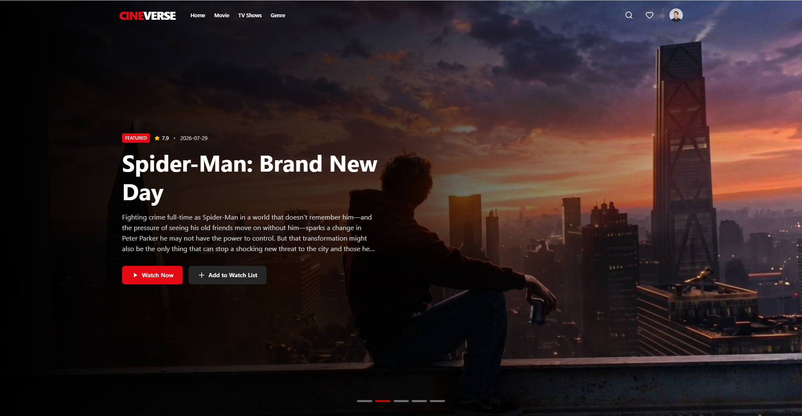
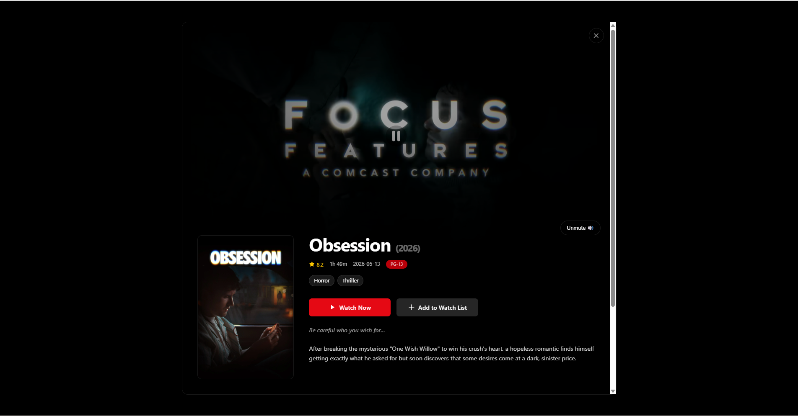
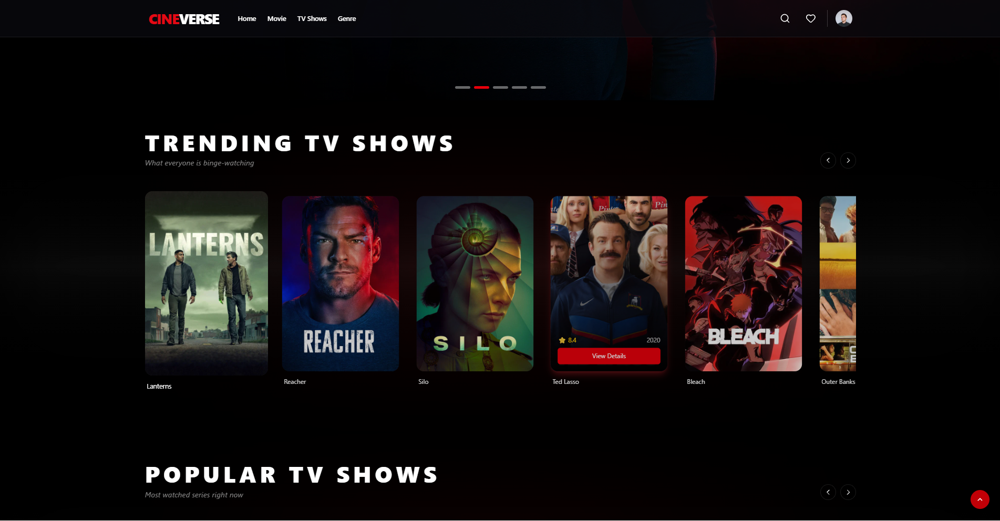
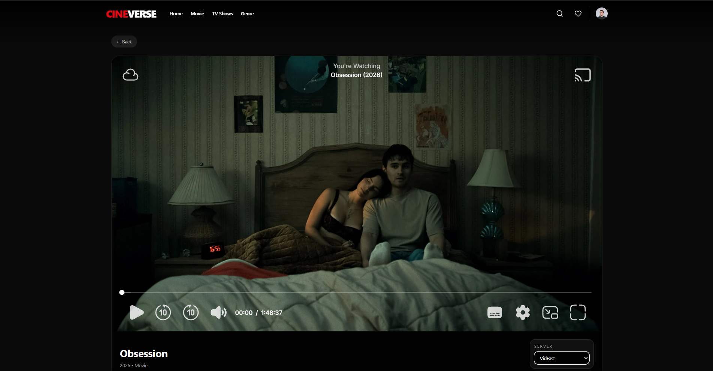

# 🎬 CineVerse

CineVerse is a responsive movie and TV show web application built with React. It allows users to discover trending, popular, and top rated movies and TV shows, view detailed information, browse by genre, save favorites, and watch available content through the application's media player.

## 🌐 Live Demo

[View CineVerse Live](https://cine-verse-ebon.vercel.app/)

## 📸 Screenshots

### Home Page



### Movie Details



### TV Shows



### Watch Page




## ✨ Features

### Movie Discovery

* Browse trending movies
* Browse popular movies
* Browse top rated movies
* View movie information
* View movie ratings
* View release dates
* View movie overviews
* Browse movies by genre

### TV Shows

* Browse TV shows
* View TV show information
* Browse TV shows by genre
* View seasons and episodes
* Access the watch page for available episodes

### Search

* Search for movies and TV shows
* Display matching results
* Navigate directly to movie or TV show details

### Movie Details

Users can view detailed information about selected movies and TV shows, including:

* Title
* Poster
* Backdrop
* Overview
* Rating
* Release information
* Genres
* Additional movie or TV show information

### Favorites

Users can save movies and TV shows to their favorites and access them through the Favorites page.

### Watch Page

CineVerse includes a dedicated watch page for movies and TV episodes.

The application supports multiple video player sources to provide alternative playback options when a source is unavailable.

### Responsive Design

The interface is designed to work across:

* Desktop
* Laptop
* Tablet
* Mobile devices

## 🛠️ Technologies Used

* React
* JavaScript
* Tailwind CSS
* React Router
* Vite
* Framer Motion
* Lucide React
* TMDB API

## 📦 Project Structure

```text
CineVerse/
├── public/
│
├── src/
│   ├── assets/
│   ├── components/
│   │   └── SharedComponents/
│   ├── context/
│   ├── pages/
│   ├── services/
│   │   └── Api.js
│   ├── App.jsx
│   ├── index.css
│   └── main.jsx
│
├── .gitignore
├── biome.json
├── eslint.config.js
├── index.html
├── package.json
├── package-lock.json
├── postcss.config.js
├── vite.config.js
└── README.md
